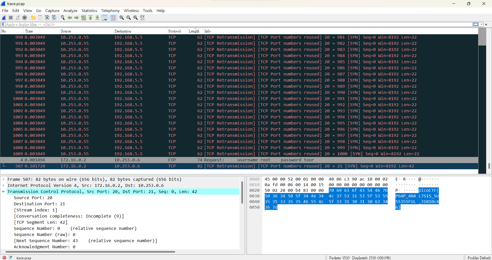

# PcapPoisoning

## Description:
How about some hide and seek heh?

Download this [file](https://artifacts.picoctf.net/c/377/trace.pcap) and find the flag.

## Hints:
(None)

## Tags:
picoCTF 2023

Forensics

pcap

## solve:
.pcap檔是流量封包檔，也就是封包檔，可以用Wireshark等封包分析軟體打開。所以我馬上載了Wireshark。打開後使用Length做排序，在最下面的封包就能看到flag:

## flag:
**picoCTF{P64P_4N4L7S1S_SU55355FUL_31010c46}**