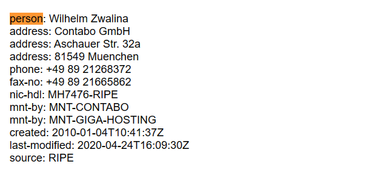

# who is it

## Description:
Someone just sent you an email claiming to be Google's co-founder Larry Page but you suspect a scam.

Can you help us identify whose mail server the email actually originated from?

Download the email file [here](https://artifacts.picoctf.net/c/499/email-export.eml). Flag: picoCTF{FirstnameLastname}

## Hints:
1. whois can be helpful on IP addresses also, not only domain names.

## Tags:
picoCTF 2023

Forensics

email

## solve:
這題是分析電子郵件，其中提到ip, whois等關鍵字，我就先使用HxD尋找檔案中的IP字樣，然後找到**173.249.33.206**這個IP，之後搜尋whois，發現這是用來查找指定ip、域名的詳細資料的網站，將IP輸入後往下找找到person，裡面的人名按照格式輸入就是flag了。

## flag:
**picoCTF{WilhelmZwalina}**